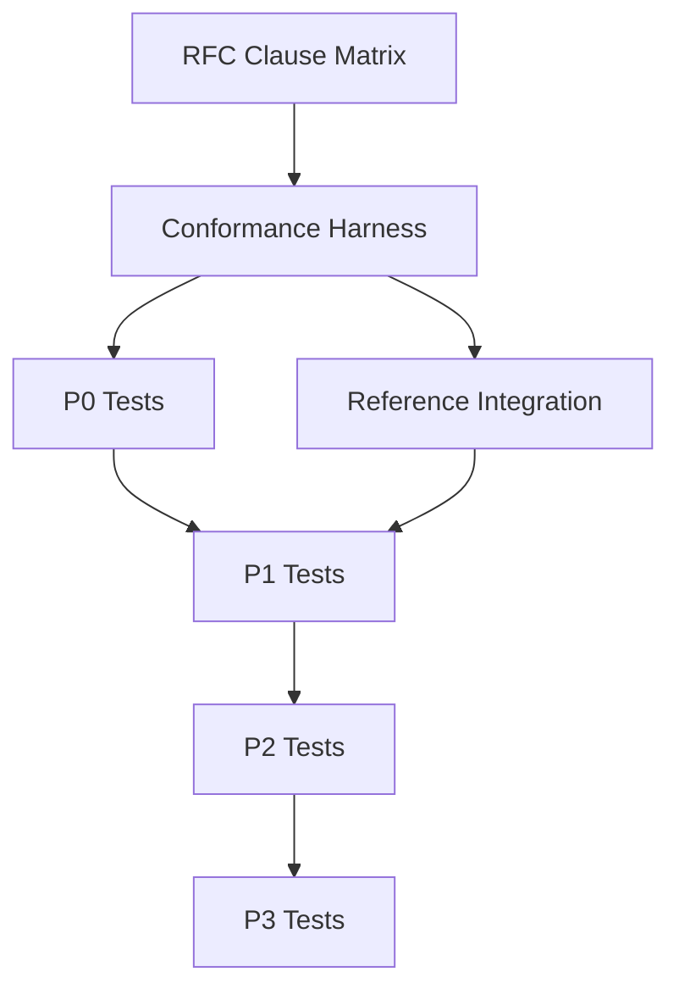

# RFC 6330 Conformance Test Priority Matrix

**Generated:** 2026-04-16  
**Purpose:** Execution roadmap for RFC 6330 conformance test implementation  
**Target:** Achieving ≥95% MUST clause coverage with systematic validation

## Priority Classification System

### Risk-Impact Scoring
Each requirement scored on two dimensions:
- **Risk Level**: Likelihood and impact of conformance failure
- **Implementation Complexity**: Effort required for comprehensive testing

**Priority Levels:**
- **P0 (Critical)**: High risk + Medium/Low complexity → Immediate implementation
- **P1 (High)**: High risk + High complexity OR Medium risk + Low complexity  
- **P2 (Medium)**: Medium risk + Medium complexity OR Low risk + Low complexity
- **P3 (Low)**: Low risk + High complexity → Deferred until infrastructure mature

## P0: Critical Priority (Immediate Implementation)

### Tuple Generation Algorithms
**Requirements**: RFC6330-5.3.1, RFC6330-5.3.2  
**Risk**: 🔴 Critical - Affects all encoding/decoding operations  
**Complexity**: 🟡 Medium - Requires differential testing setup  
**Timeline**: Week 1

#### Implementation Plan
```rust
// Target test structure
#[test]
fn systematic_tuple_generation_conformance() {
    for k in test_k_values() {
        for esi in 0..k {
            let (d, a, b) = our_systematic_tuple_gen(k, esi);
            let (ref_d, ref_a, ref_b) = reference_tuple_gen(k, esi);
            assert_eq!((d, a, b), (ref_d, ref_a, ref_b));
        }
    }
}
```

#### Success Criteria
- Systematic tuple generation matches reference implementation 100%
- Repair tuple generation matches reference implementation 100%  
- Edge cases: K=1, K=8192 (max), prime boundary conditions

---

### Lookup Table Validation
**Requirements**: RFC6330-5.5.1  
**Risk**: 🔴 Critical - Foundation for all tuple calculations  
**Complexity**: 🟢 Low - Direct array comparison  
**Timeline**: Week 1

#### Implementation Plan
```rust
#[test]  
fn lookup_tables_exact_match() {
    // Validate V0 table
    for i in 0..256 {
        assert_eq!(rfc6330::V0[i], RFC_V0_TABLE[i], "V0[{i}] mismatch");
    }
    
    // Validate V1 table  
    for i in 0..256 {
        assert_eq!(rfc6330::V1[i], RFC_V1_TABLE[i], "V1[{i}] mismatch");
    }
}
```

#### Success Criteria
- V0 table matches RFC 6330 Section 5.5 exactly (256 u32 values)
- V1 table matches RFC 6330 Section 5.5 exactly (256 u32 values)

---

### Systematic Index Validation
**Requirements**: RFC6330-5.1.1  
**Risk**: 🔴 Critical - Affects parameter derivation  
**Complexity**: 🟢 Low - Table lookup validation  
**Timeline**: Week 1

#### Implementation Plan
```rust
#[test]
fn systematic_index_table_conformance() {
    let rfc_table_2 = load_rfc_systematic_index_table();
    
    for k in 1..=8192 {
        let our_j = systematic_index(k);
        let rfc_j = rfc_table_2.lookup(k);
        assert_eq!(our_j, rfc_j, "Systematic index mismatch for K={k}");
    }
}
```

#### Success Criteria
- Systematic index J(K) matches RFC Table 2 for all valid K values
- Edge case validation: K=1, K=8192, K values around table boundaries

## P1: High Priority (Week 2-3 Implementation)

### Parameter Derivation Validation
**Requirements**: RFC6330-5.2.1, RFC6330-5.2.2, RFC6330-4.1.2  
**Risk**: 🟡 Medium-High - Core parameter calculation  
**Complexity**: 🟡 Medium - Systematic validation across parameter space  
**Timeline**: Week 2

#### K Parameter Derivation (RFC6330-4.1.2)
```rust
#[test]
fn k_derivation_systematic_validation() {
    for object_size in test_object_sizes() {
        for symbol_size in test_symbol_sizes() {
            let k = derive_k(object_size, symbol_size);
            
            // Validate K derivation formula
            validate_k_constraints(k, object_size, symbol_size);
            
            // Compare with reference implementation if available
            if let Some(ref_k) = reference_k_calculation(object_size, symbol_size) {
                assert_eq!(k, ref_k);
            }
        }
    }
}
```

#### K' and P1 Calculation (RFC6330-5.2.1, RFC6330-5.2.2)
```rust
#[test]
fn parameter_derivation_validation() {
    for k in test_k_values() {
        let k_prime = calculate_k_prime(k);
        let p1 = calculate_p1(k_prime);
        
        // Validate K' formula: K' = K + S + H
        let (s, h) = derive_s_h(k);
        assert_eq!(k_prime, k + s + h);
        
        // Validate P1 is smallest prime >= K'
        assert!(is_prime(p1));
        assert!(p1 >= k_prime);
        if p1 > k_prime {
            assert!(!is_prime(p1 - 1));
        }
    }
}
```

#### Success Criteria
- K derivation validated for comprehensive object/symbol size matrix
- K' calculation matches RFC formula for all test K values
- P1 calculation produces correct smallest prime ≥ K'

---

### Constraint Matrix Structure Validation
**Requirements**: RFC6330-5.4.1  
**Risk**: 🟡 Medium-High - Fundamental decoder structure  
**Complexity**: 🔴 High - Complex structural validation  
**Timeline**: Week 3

#### Implementation Plan
```rust
#[test]
fn constraint_matrix_structure_conformance() {
    for k in test_k_values() {
        let matrix = build_constraint_matrix(k);
        
        // Validate overall dimensions
        validate_matrix_dimensions(&matrix, k);
        
        // Validate LDPC equations structure
        validate_ldpc_equations(&matrix, k);
        
        // Validate Half symbol equations  
        validate_half_equations(&matrix, k);
        
        // Validate LT equations structure
        validate_lt_equations(&matrix, k);
        
        // Compare structure with reference implementation
        if let Some(ref_matrix) = reference_constraint_matrix(k) {
            assert_matrices_structurally_equivalent(&matrix, &ref_matrix);
        }
    }
}
```

#### Success Criteria  
- Matrix dimensions match RFC specification exactly
- LDPC equations follow RFC structure requirements
- Half symbol equations conform to RFC specification  
- LT equations match RFC algorithm exactly

## P2: Medium Priority (Week 4-5 Implementation)

### Gaussian Elimination Algorithm  
**Requirements**: RFC6330-4.3.2  
**Risk**: 🟡 Medium - Algorithm correctness  
**Complexity**: 🔴 High - Step-by-step algorithm validation  
**Timeline**: Week 4

#### Implementation Plan
```rust
#[test]
fn gaussian_elimination_algorithm_conformance() {
    for test_case in elimination_test_cases() {
        let mut matrix = test_case.initial_matrix.clone();
        let steps = our_gaussian_elimination(&mut matrix);
        
        // Compare with reference elimination steps
        let ref_steps = reference_elimination(&test_case.initial_matrix);
        assert_elimination_equivalent(&steps, &ref_steps);
        
        // Validate final matrix is in correct form
        validate_elimination_result(&matrix, &test_case);
    }
}
```

#### Success Criteria
- Elimination algorithm produces equivalent results to reference
- Step-by-step validation for matrix transformations
- Inactivation algorithm conforms to RFC specification

---

### Symbol Generation Validation
**Requirements**: RFC6330-4.2.1, RFC6330-4.2.2  
**Risk**: 🟡 Medium - Symbol correctness  
**Complexity**: 🟡 Medium - Symbol-level differential testing  
**Timeline**: Week 5

#### Systematic Symbol Validation (RFC6330-4.2.1)
```rust
#[test]
fn systematic_symbol_conformance() {
    for test_case in systematic_test_cases() {
        let symbols = encode_systematic(&test_case.source_data);
        
        // First K symbols must be source symbols exactly
        for (i, symbol) in symbols.iter().take(test_case.k).enumerate() {
            let expected = &test_case.source_data[i * symbol_size..(i + 1) * symbol_size];
            assert_eq!(symbol.data(), expected);
        }
    }
}
```

#### Repair Symbol Validation (RFC6330-4.2.2)
```rust
#[test]  
fn repair_symbol_conformance() {
    for test_case in repair_test_cases() {
        for esi in test_case.k..test_case.max_esi {
            let our_symbol = generate_repair_symbol(&test_case.source_data, esi);
            let ref_symbol = reference_repair_symbol(&test_case.source_data, esi);
            assert_eq!(our_symbol.data(), ref_symbol.data());
        }
    }
}
```

#### Success Criteria
- Systematic symbols exactly match source data in order
- Repair symbols match reference implementation exactly
- ESI assignment follows RFC specification

## P3: Low Priority (Week 6+ Implementation)

### Comprehensive Edge Cases
**Requirements**: All requirements - edge case coverage  
**Risk**: 🟢 Low - Edge case scenarios  
**Complexity**: 🟡 Medium - Comprehensive scenario generation  
**Timeline**: Week 6+

#### Boundary Condition Testing
- K=1 (minimum source block)
- K=8192 (maximum practical K)  
- Object sizes at symbol boundaries
- Prime number boundary conditions for P1

#### Error Condition Testing
- Invalid parameter ranges
- Malformed input handling  
- Memory constraint scenarios
- Timeout and cancellation behavior

## Implementation Dependencies

### Infrastructure Dependencies


### Required Infrastructure Components
1. **Conformance Test Harness** - Test execution framework
2. **Reference Implementation Integration** - Differential testing capability
3. **Golden File Management** - Complex output validation
4. **Coverage Reporting** - Systematic conformance tracking

## Test Execution Strategy

### Phase 1: Infrastructure (Week 1)
```bash
# Build conformance harness
rch exec -- env CARGO_TARGET_DIR=${TMPDIR:-/tmp}/rch_target_conformance_remaining_docs cargo run --bin raptorq_rfc6330_conformance -- --setup

# Validate harness with P0 tests  
rch exec -- env CARGO_TARGET_DIR=${TMPDIR:-/tmp}/rch_target_conformance_remaining_docs cargo test --test rfc6330_p0_conformance
```

### Phase 2: Core Algorithm Validation (Week 2-3)
```bash
# P0 critical tests
rch exec -- env CARGO_TARGET_DIR=${TMPDIR:-/tmp}/rch_target_conformance_remaining_docs cargo test --test rfc6330_tuple_generation
rch exec -- env CARGO_TARGET_DIR=${TMPDIR:-/tmp}/rch_target_conformance_remaining_docs cargo test --test rfc6330_lookup_tables
rch exec -- env CARGO_TARGET_DIR=${TMPDIR:-/tmp}/rch_target_conformance_remaining_docs cargo test --test rfc6330_systematic_index

# P1 parameter validation
rch exec -- env CARGO_TARGET_DIR=${TMPDIR:-/tmp}/rch_target_conformance_remaining_docs cargo test --test rfc6330_parameter_derivation
rch exec -- env CARGO_TARGET_DIR=${TMPDIR:-/tmp}/rch_target_conformance_remaining_docs cargo test --test rfc6330_matrix_structure
```

### Phase 3: Algorithm and Symbol Testing (Week 4-5)
```bash
# P2 algorithm tests
rch exec -- env CARGO_TARGET_DIR=${TMPDIR:-/tmp}/rch_target_conformance_remaining_docs cargo test --test rfc6330_gaussian_elimination
rch exec -- env CARGO_TARGET_DIR=${TMPDIR:-/tmp}/rch_target_conformance_remaining_docs cargo test --test rfc6330_symbol_generation

# Coverage validation
rch exec -- env CARGO_TARGET_DIR=${TMPDIR:-/tmp}/rch_target_conformance_remaining_docs cargo run --bin generate_conformance_report
```

### Phase 4: Edge Cases and Integration (Week 6+)
```bash
# P3 comprehensive testing
rch exec -- env CARGO_TARGET_DIR=${TMPDIR:-/tmp}/rch_target_conformance_remaining_docs cargo test --test rfc6330_edge_cases
rch exec -- env CARGO_TARGET_DIR=${TMPDIR:-/tmp}/rch_target_conformance_remaining_docs cargo test --test rfc6330_stress_scenarios

# Full conformance validation
rch exec -- env CARGO_TARGET_DIR=${TMPDIR:-/tmp}/rch_target_conformance_remaining_docs cargo run --bin raptorq_rfc6330_conformance -- --comprehensive
```

## Success Metrics

### Coverage Targets
- **Week 1 End**: P0 tests complete, 40% MUST clause coverage
- **Week 3 End**: P1 tests complete, 70% MUST clause coverage  
- **Week 5 End**: P2 tests complete, 90% MUST clause coverage
- **Week 6+ End**: P3 tests complete, 95%+ total requirement coverage

### Conformance Score Progression
| Week | MUST Coverage | SHOULD Coverage | Overall Score | Status |
|------|---------------|-----------------|---------------|---------|
| 0 | 20% | 0% | 22.2% | ❌ Non-conformant |
| 1 | 40% | 0% | 44.4% | ⚠️ Developing |  
| 3 | 70% | 50% | 75.0% | ⚠️ Partial |
| 5 | 90% | 100% | 91.7% | ⚠️ Near-conformant |
| 6+ | 95%+ | 100% | 95%+ | ✅ **RFC 6330 Conformant** |

---

**Status**: Priority matrix established. P0 tests should begin immediately with lookup table validation as the foundation, followed by tuple generation and systematic index validation. Infrastructure development can proceed in parallel.
